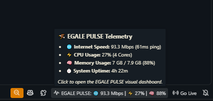
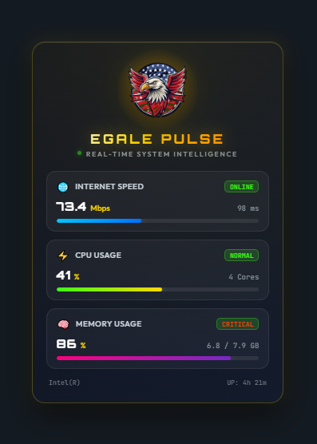

# 🦅 EGALE PULSE — Real-Time System Intelligence

[](https://code.visualstudio.com/)
[](https://www.typescriptlang.org/)
[]()
[](https://opensource.org/licenses/MIT)

> A sleek, high-performance Visual Studio Code extension providing **Real-Time System Intelligence (Internet Speed, CPU Usage, and Memory Usage)** with custom **EGALE CODERS** branding and bottom-right corner dashboard.

---

## 📦 Extension Overview & Visual Previews

<div align="center">
  
  <h1>EGALE PULSE</h1>
  <p><strong>Real-Time System Intelligence & Telemetry for Visual Studio Code</strong></p>
</div>

### 1. 📍 Bottom-Right Status Bar & Hover Tooltip
Always-on live telemetry right at your fingertips without interrupting your coding flow:

<div align="center">
  
</div>

### 2. ⚡ Futuristic Visual Dashboard
A glassmorphism cyber-aesthetic dashboard providing real-time hardware and network analytics:

<div align="center">
  
</div>

---

## 🚀 How to Start in VS Code

Getting started with **EGALE PULSE** is effortless:

### 1. Automatic Activation
Once installed, **EGALE PULSE** activates automatically on startup. Check the **bottom-right corner** of your VS Code status bar for the live telemetry stream:
```
⚡ EGALE PULSE: 🌐 93.3 Mbps | ⚡ 27% | 🧠 88%
```

### 2. View Quick Telemetry Breakdown (Hover)
Hover your mouse over the status bar item to see an instant pop-up summary:
- **🌐 Internet Speed & Latency**: Live Mbps throughput & ping response time.
- **⚡ CPU Load**: Real-time percentage load & detected core count.
- **🧠 Memory Usage**: Exact GB consumption (`Used / Total GB`) and percentage.
- **⏱️ System Uptime**: System uptime duration.

### 3. Open the Interactive Visual Dashboard
You can launch the full visual dashboard at any time using any of the following methods:
* **🖱️ One-Click**: Click directly on the bottom-right status bar item.
* **⌨️ Keyboard Shortcut**: Press `Ctrl + Alt + E` (on macOS: `Cmd + Alt + E`).
* **🔍 Command Palette**: Press `Ctrl + Shift + P` (`Cmd + Shift + P`), type `EGALE PULSE: Open Real-Time System Dashboard`, and press Enter.
* **🦅 Activity Bar / Sidebar**: Click the **EGALE PULSE** eagle icon on the left Activity Bar to view live telemetry pinned in your sidebar while you code.

---

## ✨ Features

1. 🌐 **Real-Time Internet Speed & Latency**:
   - Live download/upload throughput measured in **Mbps**.
   - Ping response latency in **ms**.
   - Connection stability and network status badge (`ONLINE` / `LATENCY HIGH` / `OFFLINE`).

2. ⚡ **Real-Time CPU Usage**:
   - Real-time total CPU load percentage (`%`).
   - Active core detection and dynamic multi-core monitor.
   - Animated visual load bar.

3. 🧠 **Real-Time Memory (RAM) Usage**:
   - Accurate RAM utilization in **GB** (`Used / Total GB`) and percentage (`%`).
   - Dynamic memory health status indicator (`HEALTHY` / `ELEVATED` / `CRITICAL`).

4. 🦅 **Official EGALE CODERS Cyber Branding**:
   - Styled with Orbitron typography, neon accents, and smooth progress transitions.

---

## 🎮 Commands & Keybindings

| Command | Title | Keybinding | Description |
| :--- | :--- | :---: | :--- |
| `egalePulse.openDashboard` | **EGALE PULSE: Open Real-Time System Dashboard** | `Ctrl+Alt+E` (`Cmd+Alt+E`) | Opens the visual system telemetry dashboard. |

---

## 📁 Clean & Modular Functional Architecture

```
egale-pulse/
├── .vscode/
│   ├── launch.json              # F5 Extension Debugging configuration
│   └── tasks.json               # Build & watch tasks
├── media/
│   ├── css/
│   │   └── dashboard.css        # Futuristic glassmorphism styling & Orbitron typography
│   ├── js/
│   │   └── dashboard.js         # Live metric animation & UI script
│   ├── icons/
│   │   └── ECLogo.png           # EGALE CODERS Official Logo
│   └── screenshots/
│       ├── statusbar-preview.png# Status bar & hover tooltip preview
│       └── dashboard-preview.png# Full visual dashboard preview
├── src/
│   ├── extension.ts             # Functional extension lifecycle & command registration
│   ├── types/
│   │   └── metrics.ts           # Telemetry data types & interfaces
│   ├── telemetry/
│   │   ├── cpu.ts               # Functional CPU load calculator
│   │   ├── memory.ts            # Functional RAM usage reader
│   │   ├── network.ts           # Functional network latency & speed estimator
│   │   ├── uptime.ts            # Functional uptime formatter
│   │   └── systemMonitor.ts     # Aggregator factory function createSystemMonitor()
│   └── ui/
│       ├── statusBar.ts         # Functional Status Bar service (createStatusBarManager)
│       └── webview/
│           ├── dashboardHtml.ts # Pure HTML generator function
│           ├── dashboardPanel.ts# Functional webview panel controller
│           └── sidebarView.ts   # Functional webview view provider factory
├── package.json                 # Extension manifest & scripts
├── tsconfig.json                # TypeScript compiler configuration
├── CHANGELOG.md                 # Version changelog
├── LICENSE                      # MIT License
├── README.md                    # Git repository documentation
└── README_EXTENSION.md          # VS Code marketplace documentation
```

---

## 👨‍💻 Development & Debugging

1. Open the `egale-pulse` folder in VS Code.
2. Run `npm install` (if not already run).
3. Press **`F5`** on your keyboard (or click **Run and Debug** -> **Run Egale Pulse Extension**).
4. A new **`[Extension Development Host]`** window will open with live telemetry active!

---

## 📄 License

Distributed under the MIT License. See [LICENSE](./LICENSE) for details.

<p align="center">
  Crafted with 🦅 by <strong>EGALE CODERS</strong>
</p>
